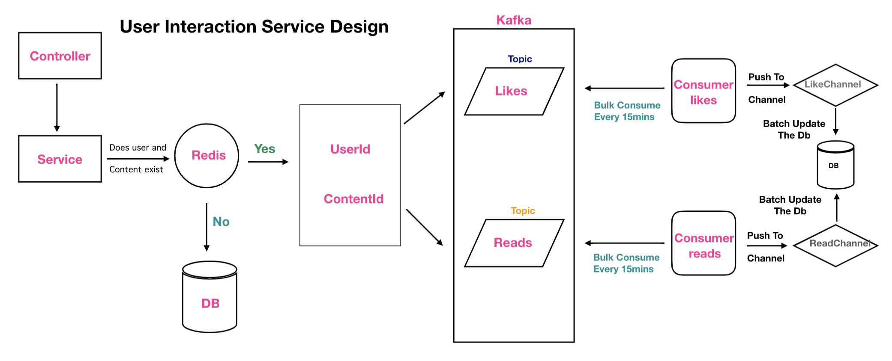

# Content Service

> Content Service built with Golang ang gin package

## Features

- Functionality to perform CRUD operation on the contents.

### Env Variables

Create a .env file in then config folder and add the following

```
APP_ENV=service name
DB_USERNAME=user name of db
DB_HOST_READER=reader db url
DB_HOST_WRITER=writer db url
DB_PORT=port on which db is running
DB_PASSWORD=password of the db
DB_NAME=name of the database
DB_MAX_IDLE_CONNECTION=maximum no of idle connections
DB_MAX_OPEN_CONNECTIONS=maximum no of open connections
SERVICE_NAME=name of the service
SERVER_PORT=port on ehich server will run
REDIS_ADDRESS=redis url
CACHE_ENABLED=boolean value to control redis cache
INTERACTION_SERVICE_BASE_URL=base url of the interaction service
INTERACTION_HEADER=header string to pass by any service to access the internal api endpoint
```

### Install Dependencies

```
go mod download
go build
```

### Run

```
# Run backend (:4000)
go run .
```

## HLD User Interaction Service
